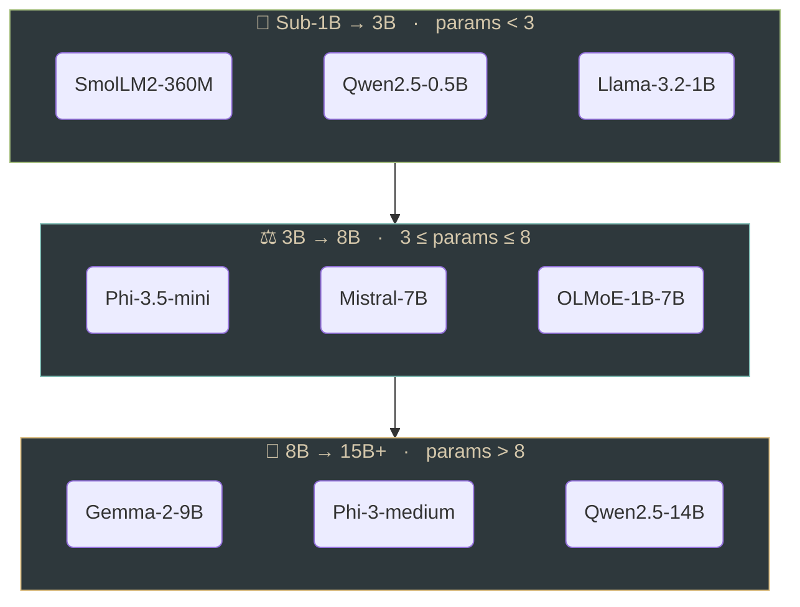
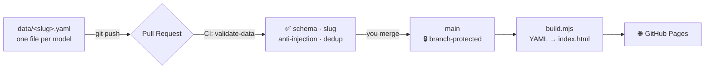
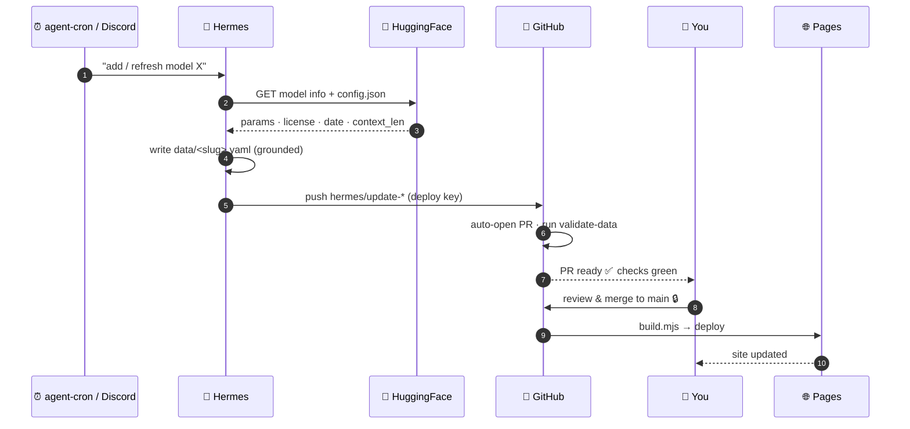

<div align="center">

# 🧠 my-small-slm-notes

**A living, size-bucketed field guide to the small language models worth knowing.**

_One YAML file per model · HuggingFace-grounded · auto-curated by a homelab agent · published as a static site._

<!-- BADGES -->
[](https://github.com/kamilrybacki/my-small-slm-notes/actions/workflows/deploy.yml)
[](https://github.com/kamilrybacki/my-small-slm-notes/actions/workflows/validate.yml)
[](LICENSE)
[](#-how-hermes-keeps-it-current)
[](https://kamilrybacki.github.io/my-small-slm-notes/)

</div>

---

<!-- HOOK: Hermes-authored -->
> _Hook — pending Hermes contribution (run `README-MSSN-2101`)._

## 📚 Table of contents
- [Why this exists](#-why-this-exists)
- [The three buckets](#-the-three-buckets)
- [How it works](#-how-it-works)
- [How Hermes keeps it current](#-how-hermes-keeps-it-current)
- [Two ways to update](#-two-ways-to-update)
- [The validation gate](#-the-validation-gate)
- [Quickstart](#-quickstart)
- [Adding a model](#-adding-a-model)
- [One-time GitHub setup](#-one-time-github-setup)
- [Layout](#-layout)

## 🎯 Why this exists

<!-- WHY: Hermes-authored -->
> _Why — pending Hermes contribution._

## 🪣 The three buckets

Every model is filed by **total parameters (in billions)** into exactly one class. The boundary is deterministic — `8B` lands in mid, `3B` lands in mid, no gaps, no overlaps:

| Class | Rule | Built for |
|---|:---:|---|
| **Sub-1B → 3B** | `params < 3` | Ultra-compact models for mobile devices and local processing — lightweight on-device assistants. |
| **3B → 8B** | `3 ≤ params ≤ 8` | Mid-range small models balancing general capability and low latency — many modern mini open-source releases. |
| **8B → 15B+** | `params > 8` | Higher-capacity compact models approaching the threshold of larger language systems. |

> MoE models are filed by **total** params and carry an extra `active_params` field.



## ⚙️ How it works

This is a **git-driven static site** — no backend, no database, no public write endpoint. The source of truth is a folder of YAML files; everything else is derived.



- **Source of truth:** one `data/<slug>.yaml` per model. The filename **must** equal the model's slug.
- **Build:** [`scripts/build.mjs`](scripts/build.mjs) reads every `data/*.yaml`, sorts by params into the three buckets, and emits a single self-contained `dist/index.html` (+ machine-readable `dist/models.json`). No framework, no runtime JS.
- **Publish:** merging to `main` triggers [`deploy.yml`](.github/workflows/deploy.yml) → GitHub Pages.

## 🤖 How Hermes keeps it current

<!-- HERMES-FLOW: Hermes-authored -->
> _Narrative — pending Hermes contribution._



**The mechanics** (what Hermes actually runs):

1. Adds the model to [`scripts/models.manifest.json`](scripts/models.manifest.json) (curated `notes`, `modality`, `active_params`).
2. Runs `npm run hf-sync` — [`scripts/hf-sync.mjs`](scripts/hf-sync.mjs) pulls **grounded facts from HuggingFace**, never free-recall:

   | Field | Source |
   |---|---|
   | `params` | `GET /api/models/{id}` → `safetensors.total` ÷ 1e9 |
   | `license` | `cardData.license` |
   | `release_date` | `createdAt` |
   | `context_len` | `{id}/resolve/main/config.json` → `max_position_embeddings` |

3. Commits the resulting `data/*.yaml` to a `hermes/update-<date>` branch and pushes it with a **write-scoped deploy key** (stored in Vault — never baked into an image). Hermes never calls `gh`.
4. [`auto-pr.yml`](.github/workflows/auto-pr.yml) opens the PR. **A human merges.** Because `main` is branch-protected and requires the `validate-data` check, the deploy key **cannot** bypass the gate — the merge is the one and only door.

> Gated repos (Llama, Gemma) expose no anonymous `config.json`, so `context_len` honestly falls back to the `unknown` sentinel unless `HF_TOKEN` is set.

## ✍️ Two ways to update

**Automated — Hermes.** Weekly `agent-cron` + on-demand ("add model X" in Discord). See above.

**Manual — you.** Edit `data/<slug>.yaml` (GitHub web UI or a branch), open a PR, let CI pass, merge. Same single source of truth, same gate. See [CONTRIBUTING.md](CONTRIBUTING.md).

## 🛡️ The validation gate

[`scripts/validate.mjs`](scripts/validate.mjs) runs on every PR and every `hermes/**` push. **Hard failures block the merge:**

1. YAML parses.
2. Schema valid ([`schema/model.schema.json`](schema/model.schema.json)) — all required fields present.
3. `filename === slug(name) + '.yaml'`.
4. No two files resolve to the same slug (exact-slug collision → error; **update** the existing file instead of duplicating).
5. No `<`, `>`, or `javascript:` in any text field — output is HTML-escaped at build too.

**Advisory only** (warns, never blocks): near-duplicate names **with equal params** — catches respellings like `SmolLM2-360M` vs `smollm-2-360m`, while never flagging genuine siblings like `Qwen2.5-0.5B` vs `Qwen2.5-1.5B`.

**Unknowns:** soft fields (`license`, `context_len`, `modality`, `release_date`) accept the literal `unknown`. `name`, `params`, `url` must be real.

## 🚀 Quickstart

```bash
npm install
npm run hf-sync                     # regenerate data/*.yaml from HF (all manifest ids)
npm run hf-sync Qwen/Qwen2.5-0.5B   # ...or a single id
npm test                            # unit + data-integrity tests
npm run validate                    # run the CI gate locally
npm run build                       # → dist/index.html + dist/models.json
```
Set `HF_TOKEN=<token>` to ground `context_len` for gated repos.

## 🧩 Adding a model

One model = one file: `data/<slug>.yaml`.

```yaml
name: SmolLM2-360M          # required, real. Never "unknown".
params: 0.36                # required, real. TOTAL params in B. Drives the bucket.
active_params: 1.3          # OPTIONAL — MoE only (active params in B).
license: Apache-2.0         # required. May be "unknown".
context_len: 8192           # required. Integer tokens, or "unknown".
modality: text              # required. e.g. text, text+vision. May be "unknown".
release_date: "2024-11-01"  # required. ISO YYYY-MM-DD, or "unknown".
url: https://huggingface.co/HuggingFaceTB/SmolLM2-360M  # required, real http(s).
notes:                      # required. Unordered list, >= 1 item.
  - Trained on ~4T tokens.
  - Edge-friendly.
quant_available: true       # required. Boolean.
```

Slug rule: `name.toLowerCase()`, non-alphanumeric runs → `-`, trimmed (`Qwen2.5-0.5B` → `qwen2-5-0-5b.yaml`). Full details in [CONTRIBUTING.md](CONTRIBUTING.md).

## 🔧 One-time GitHub setup

| Step | Where | Why |
|---|---|---|
| **A** | Settings → Pages → Source: **GitHub Actions** | `deploy.yml` can't publish without it. |
| **B** | Settings → Actions → General → ✅ **Allow Actions to create and approve PRs** | Hermes's `auto-pr.yml` needs it (off by default). |
| **C** | Settings → Branches → protect `main`, require **`validate-data`** | Makes the gate real — set *after* the first CI run registers the check. Required-checks match the **job** name, not the workflow title. |
| **D** | Settings → Deploy keys → add Hermes's **write** key; store the private half in Vault | Hermes's push path. Optional ruleset: restrict it to `hermes/*` refs. |

```bash
# D — generate Hermes's write-scoped deploy key
ssh-keygen -t ed25519 -f my-small-slm-notes-deploy -N "" -C "hermes-my-small-slm-notes"
# GitHub: Settings → Deploy keys → Add → paste .pub → ✅ Allow write access
vault kv put secret/my-small-slm-notes-deploy private_key=@my-small-slm-notes-deploy
rm my-small-slm-notes-deploy my-small-slm-notes-deploy.pub
```

## 🗂️ Layout

```
data/                          one <slug>.yaml per model (source of truth)
schema/model.schema.json       JSON Schema (draft 2020-12) for an entry
src/lib.mjs                    pure fns: bucketOf, slugify, dedup, grouping
scripts/hf-sync.mjs            HF-grounded writer — Hermes's updater
scripts/models.manifest.json   which models + curated notes/modality
scripts/build.mjs              YAML → dist/index.html + models.json
scripts/validate.mjs           the CI gate
test/                          node:test suites (lib + data integrity)
.github/workflows/             auto-pr · validate · deploy
```

## 📄 License

Code under [MIT](LICENSE). Model metadata is factual; every entry links its upstream HuggingFace source.

<div align="center"><sub>Curated by a human and <a href="#-how-hermes-keeps-it-current">Hermes</a> 🤖 · built statically · updated by pull request.</sub></div>
